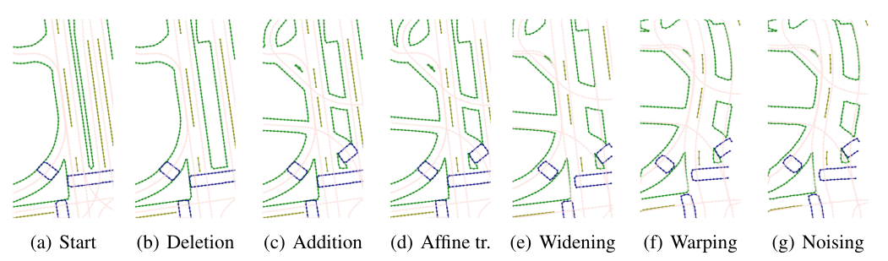
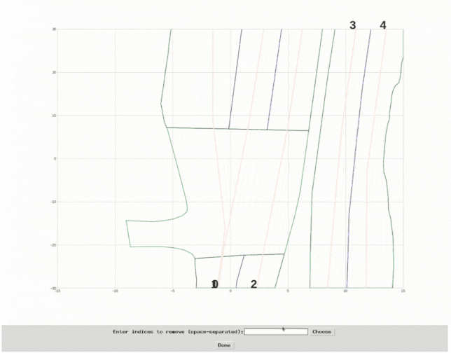
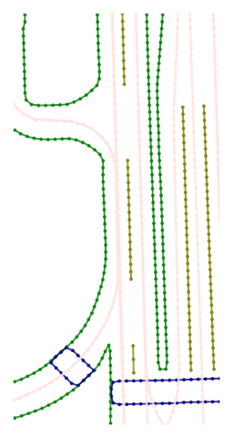
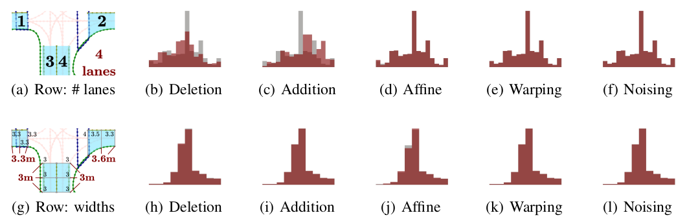
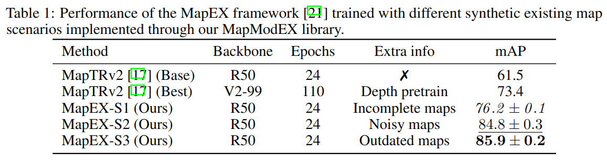

# MapModEX: A modding library to generate new maps from existing ones

This repository is the official implementation of [MapModEX: A modding library to generate new maps from existing ones](). 

HDMaps play a central role in modern autonomous driving frameworks, being at the center of basic geolocalization to complex trajectory forecasting. However, there is a remarkable lack of tools to modify HDMaps in the current autonomous driving ecosystem. In this paper, we propose MapModEX, a new library that allows simple and procedural manipulation of existing HDMaps for many possible applications. We also provide an experimental demonstration of MapModEX's usefulness for online HDMap estimation and critical scenario construction.



<!-- #TODO Visuals -->

# Table of Contents
1. [Requirements](#Installation)
2. [Usage](#Usage)
3. [Results](#results)
4. [Contributing](#contributing)
5. [License](#License)


## Requirements
The running environment requirements of MapModEX depend on the database. If you use nuScenes, you need to install the [nuScenes devkit](https://github.com/nutonomy/nuscenes-devkit/blob/master/docs/installation.md):
```setup
pip install nuscenes-devkit
```
If you use Argovers 2, you need to install [av2 devkit](https://argoverse.github.io/user-guide/getting_started.html#setup).

<!-- (To be continued)Use the package manager [pip](https://pip.pypa.io/en/stable/) to install MapModEX.
```bash
pip install mapmodex
``` -->

## Usage
We provide a run file [execution_ex.py](./python-sdk/execution_ex.py) illustrating how to use MapModEX.
```python
from mapmodex import MapModEX

## load MapModEX
mme = MapModEX(./data)

## set perturbation versions
pt_geom_1 = {'del_lan':[1, 0.3, None]} #randomly delet lanes
mme.update_pt_version([pt_geom_1])

## launch MapModEx
mme.mod_nuscenes('v1.0-mini', vis=True) #When vis is true, PNG files are generated for visualization.
```

#### DIY Mode
MapModEX supports a DIY mode（manual mode）, which is controlled by the parameter 'diy'.
```python
## set perturbation versions
pt_geom_1 = {'del_lan':[1, 0.3, None], 'diy':True} #randomly delet lanes
```
In DIY mode, you can select specific map layers to perturb, and you can also enter perturbance parameters.

Layer Selection Window             |  Step by step results
:-------------------------:|:-------------------------:
  |  
```setup
Enter shift xoff: 3
Enter shift yoff: 3
Enter rotate angle: 90
Enter scale xfact(can only be 1 or -1): 1
Enter scale yfact(can only be 1 or -1): 1
Enter your inclination amplitude: 1.5
Enter gaussian standard: 0.07
```
## Results

Our model achieves the following performance:
Original(gray) and perturbed(red) distributions of lanes in a map (first line) and width of lanes (second line) in the nuScenes dataset for five perturbations (x-axis:lanes/width, y-axis:elements).


Performance of the MapEX framework trained with different synthetic existing map scenarios implemented through our MapModEX library.


<!-- ## Support
Please open an issue to ask your questions. -->

## Contributing
Pull requests are welcome. For significant changes, please open an issue first to discuss what you want to change.

Please make sure to update tests as appropriate.

<!-- ## Authors and acknowledgment -->

## License
[MIT](https://choosealicense.com/licenses/mit/)

<!-- ## Tests -->