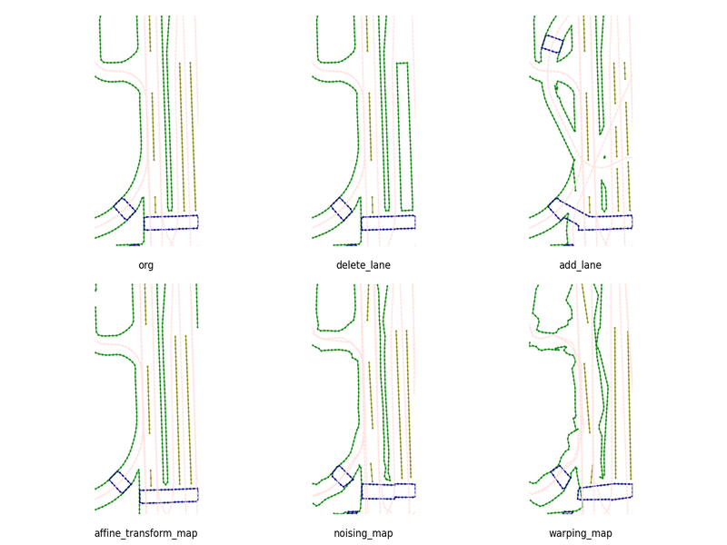

# MapModEX

HDMaps play a central role in modern autonomous driving frameworks, being at the center of basic geolocalization to complex trajectory forecasting. However, there is a remarkable lack of tools to modify HDMaps in the current autonomous driving ecosystem. In this paper, we propose MapModEX, a new library that allows simple and procedural manipulation of existing HDMaps for many possible applications. We also provide an experimental demonstration of MapModEX's usefulness for online HDMap estimation and critical scenario construction.



<!-- #TODO Visuals -->

# Table of Contents
1. [Installation](#Installation)
2. [Usage](#Usage)
3. [Support](#support)
4. [License](#License)
5. [Authors and acknowledgment](#authors-and-acknowledgment)
6. [Contributing](#contributing)
<!-- 7. [Tests](#tests) -->


## Installation
The running environment requirements of MapModEX depend on the database. If you use nuScenes, you need to install the [nuScenes devkit](https://github.com/nutonomy/nuscenes-devkit/blob/master/docs/installation.md):
```bash
pip install nuscenes-devkit
```
If you use Argovers 2, you need to install [av2 devkit](https://argoverse.github.io/user-guide/getting_started.html#setup).

<!-- (To be continued)Use the package manager [pip](https://pip.pypa.io/en/stable/) to install MapModEX.
```bash
pip install mapmodex
``` -->

## Usage
We provide a run file [execution_ex.py](./python-sdk/execution_ex.py) illustrating how to use MapModEX.
```python
from mapmodex import MapModEX

## load MapModEX
mme = MapModEX(data_root:str)

## set perturbation versions
pt_geom_1 = {'del_lan':[1, 0.3, None]}   # randomly delet lanes
mme.update_pt_version([pt_geom_1])

## lunch MapModEx
mme.mod_nuscenes(map_version_nusc:str)
```

## Support
Please open an issue to ask your questions.

## Contributing
Pull requests are welcome. For significant changes, please open an issue first to discuss what you want to change.

Please make sure to update tests as appropriate.

## Authors and acknowledgment

## License
<!-- [MIT](https://choosealicense.com/licenses/mit/) -->

<!-- ## Tests -->